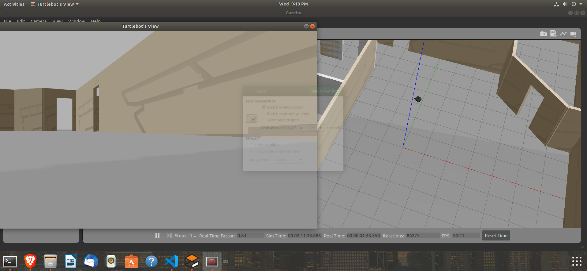
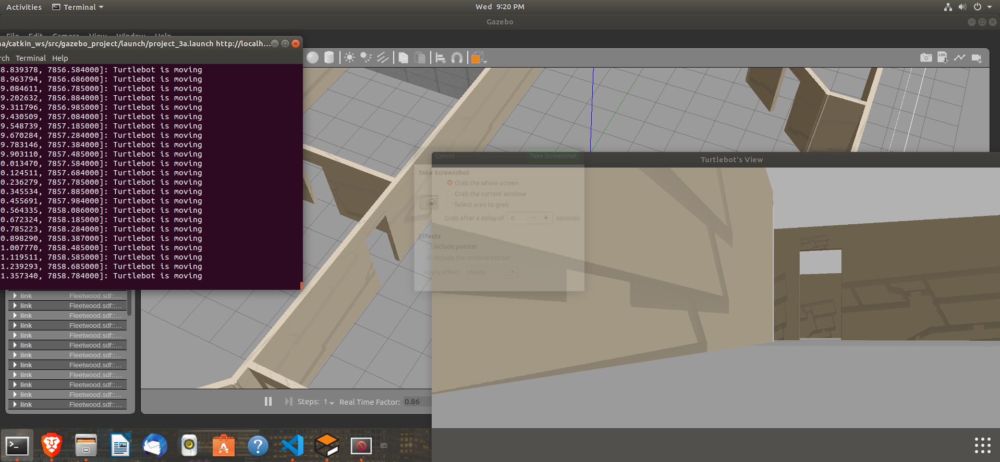

## TURTLEBOT EXPLORE

This is a small project as a part of a course `Perception in Robotics`
The project is developed in _Robot Operating System (ROS)_ and uses the common `Turtle Bot Waffle`

I have created a ROS server that subscribes to the _RGBD Camera_ of the turtle bot and runs a series of path planning commands.
The server moves the bot by publishing to the `cmd_vel` topic and displays continuous images using _OpenCV_ libraries.

### Here are some images of the Turtlebot in action

